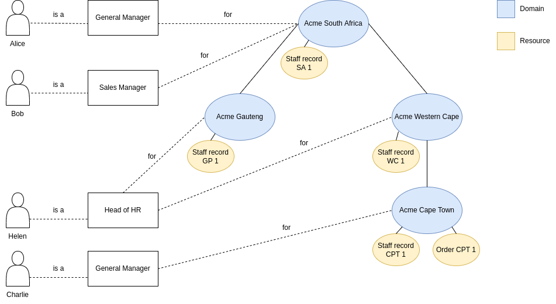

.. Dominion documentation master file, created by
   sphinx-quickstart on Sun May 22 15:00:19 2022.
   You can adapt this file completely to your liking, but it should at least
   contain the root `toctree` directive.

Welcome to Dominion's documentation
===================================

.. toctree::
   :maxdepth: 2
   :caption: Contents:

**Dominion** manages user accounts, authentication and role based access control.
Third party products offload the heavy lifting to Dominion and can then focus on their core
offering.

Overview
--------

Let's start with an example application. We're writing a staff and inventory system
for a national company *Acme* with a national head office, regional offices and
offices in towns. Dominion allows us to do the following:

Terminology in one line
~~~~~~~~~~~~~~~~~~~~~~~

A **domain** is an abstract nestable construct. It typically represents an organization or site.

A **resource** is anything belonging to a domain, for example an order or a staff record. Resources
are also nestable.

A **role** is the answer to the question *what am I?* For example:
*What am I?* I am a Manager.

A **permission** is the X in the question *can a particular user X?* For example:
*Can a particular user View Orders?*.

Role-permission mapping
~~~~~~~~~~~~~~~~~~~~~~~

Roles are mapped to permissions for every domain. If a domain does not
specify its own mapping then the mapping is inherited from its parent
domain. The default role-permission mapping provided by Dominion is:

.. list-table:: Default role-permission mapping
   :widths: 16 14 14 14 14 14 14
   :header-rows: 1

   * -
     - Create
     - Read
     - Update
     - Delete
     - Check access
     - Manage roles

   * - Anonymous
     -
     -
     -
     -
     -
     -

   * - Authenticated
     -
     - x
     -
     -
     -
     -

   * - Manager
     - x
     - x
     - x
     -
     -
     - x

   * - Owner
     - x
     - x
     - x
     - x
     -
     - x

   * - Access checker
     -
     -
     -
     -
     - x
     -

Our application's role-permission mapping is more extensive. We don't override
any of the default role-permissions mappings, so they are implicitly still
present. It is up to our application to decide whether to use them or not.

.. list-table:: Our application role-permission mapping
   :widths: 34 33 33
   :header-rows: 1

   * -
     - View orders
     - View staff records

   * - Manager
     - x
     - x

   * - Sales manager
     - x
     - 

Finally we reach the effective set of user permissions. These permissions
are computed from our domain hierarchy, the role-permission mappings per domain
and the user roles per domain.

.. list-table:: Effective user permissions
   :widths: 16 14 14 14 14 14 14
   :header-rows: 1

   * -
     - View orders for Acme SA
     - View staff records for Acme SA
     - View orders for Acme WC
     - View staff records for Acme WC
     - View orders for Acme CPT
     - View staff records for Acme CPT

   * - Alice
     - x
     - x
     - x
     - x
     - x
     - x

   * - Bob
     - x
     - 
     - x
     -
     - x
     - 

   * - Charlie
     -
     - 
     -
     -
     - x
     - x 

Index
-----

.. toctree::

  example
